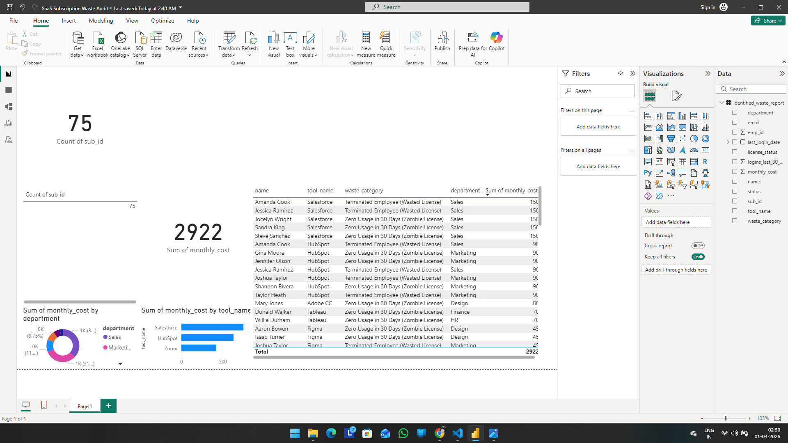

# 🔍 SubScan: SaaS Subscription Waste Analyzer

SubScan solves a major business headache: wasted software spend. It uses Python to audit SaaS billing data and flag unused licenses. These insights are transformed into a clean Power BI dashboard and Excel report, giving stakeholders a prioritized cut-list to instantly reduce hidden costs and improve their company's bottom line.

## 🎯 Business Value Demonstrated
* **Cost Reduction:** Identified **$35,064** in annualized wasted spend within a simulated 75-employee company.
* **Process Automation:** Built a reproducible Python pipeline to replace manual spreadsheet auditing.
* **Actionable Insights:** Categorized waste into "Zombie Licenses" (zero usage) and "Terminated Employees" (failed offboarding).

## 🛠️ Tech Stack
* **Python:** Core logic, synthetic data generation (`Faker`), and pipeline execution.
* **Pandas:** Data ingestion, table joins (simulating SQL logic), and data cleaning.
* **Power BI / Excel:** Final stakeholder reporting and visualization *(Dashboard in progress)*.

## 📁 Project Structure
* `/scripts/generate_billing_data.py`: Engineers a realistic, multi-table relational dataset (Employees, Subscriptions, Usage Logs) with intentionally injected business anomalies.
* `/scripts/analyze_waste.py`: The analytics engine. Merges tables and applies business logic to categorize and calculate wasted spend.
* `/data/`: Contains the generated CSVs and the final `identified_waste_report.csv`.

## 🚀 How to Run
1. Clone the repository.
2. Install requirements: `pip install pandas faker`
3. Generate the data: `python scripts/generate_billing_data.py`
4. Run the audit: `python scripts/analyze_waste.py`

## 🌍 Real-World Application
While this repository uses synthetic data (`Faker`) for demonstration purposes, the core analytics engine is designed to be easily deployed in a real corporate environment:
1. **Data Ingestion:** Swap the synthetic data generator with real CSV exports from HR (Employee Directory), IT (SSO Login Activity), and Finance (SaaS Billing).
2. **Standardization:** Map the company's specific column names to the engine's standard schema.
3. **Execution:** Run the Python audit script to automatically merge the disparate datasets, apply the business logic, and generate the actionable waste report.
4. **Continuous Monitoring:** The Power BI dashboard can be connected directly to this output, providing leadership with an always up-to-date view of software spend efficiency.